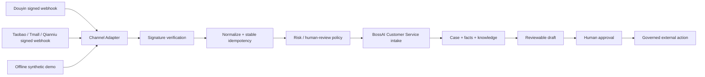

# BossAI Douyin / Taobao Customer Service Connector

[](https://github.com/liufeng1976/douyin-taobao-cs/actions/workflows/ci.yml)
[](https://github.com/liufeng1976/douyin-taobao-cs/stargazers)
[](LICENSE)

**抖音电商 / 淘宝 / 天猫 / 千牛客服消息 Connector 参考实现。** 聚焦签名校验、消息标准化、幂等、最小数据、风险分级、人工审核和 BossAI Customer Service 接入边界。

**API-free first run：没有抖音或淘宝 API 也可以完整运行 Demo、测试和 CI。**

> 这是 BossAI 的公开 source-available 技术与获客项目，不声称已经获得抖音/淘宝生产 API 权限，也不把自动回复、退款或订单修改伪装成已上线能力。

[English README](README_EN.md) · [v1.1.0 Release](https://github.com/liufeng1976/douyin-taobao-cs/releases/tag/v1.1.0) · [60 秒反馈 / 集成问题](https://github.com/liufeng1976/douyin-taobao-cs/issues/new?template=community_demo_feedback.yml) · [BossAI 官网](https://bossaios.com)

## 3 分钟跑起来

要求：Node.js 20+。

```bash
git clone https://github.com/liufeng1976/douyin-taobao-cs.git
cd douyin-taobao-cs
npm ci
npm run demo
```

`npm run demo` 只使用合成消息和演示密钥：

- 不调用抖音 / 淘宝真实 API；
- 不需要商家账号；
- 不联网调用模型；
- 不发送客户消息；
- 不退款、不取消、不修改订单。

你会看到两类模拟签名都验证成功，并输出统一的 `bossai.customer-service-connector-envelope.v1`：

```text
=== Douyin simulated signed webhook ===
signatureVerified=true
...
=== Taobao/Qianniu simulated signed webhook ===
signatureVerified=true
...
=== Demo result ===
PASS
```

Demo 跑完或遇到集成问题，可以用 [60 秒 Community Demo Feedback](https://github.com/liufeng1976/douyin-taobao-cs/issues/new?template=community_demo_feedback.yml) 告诉我们结果；无需提供任何平台凭据。

完整本地验收：

```bash
npm run check
```

当前 `v1.1.0` 已正式发布，并在 GitHub Actions 与本地验收中验证：

```text
20/20 channel-adapter tests passed
17/17 local E2E passed
Channel adapter verification passed
```

## 为什么这个项目值得看

很多 AI 客服示例把平台 API、模型 Key、知识库、自动回复和订单动作全部塞进一个脚本。这样做有三个问题：

1. 没有真实平台 API 就无法运行；
2. 退款、投诉、改地址等高风险消息也可能被自动处理；
3. 平台账号、Provider Key、客户数据和业务状态混在一个小服务里，难以治理。

本项目把问题收敛为一个可复用的 **Channel Adapter / Reference Implementation**：



## 已实现能力

### 抖音电商入站

- 保留原始请求体参与签名校验；
- 支持配置的 `MD5` / `HMAC-SHA256` `event-sign` 模式；
- 校验回调 `app-id`；
- 支持数组式消息推送；
- 优先使用平台消息 ID，没有 ID 时生成稳定、账号隔离的 SHA-256 幂等 ID；
- canonical intake 接收失败时返回 5xx，不会先 ACK 再静默丢消息；
- `msg_id=0` 平台探针只 ACK，不创建客户 Case；
- 直接发送和轮询自动回复已 fail-closed。

### 淘宝 / 天猫 / 千牛入站

- 消息回调按 `HEX(HMAC-SHA256(app_key + raw_body, app_secret))` 校验；
- 支持常见 OpenIM / 消息字段标准化；
- TOP 请求使用 HMAC-SHA256 签名和国内网关；
- Webhook 热路径不查询订单；
- 可选订单事实读取只保留订单号、状态、支付和商品标题/SKU/数量；
- 不请求收件人姓名、手机号、详细地址；
- 直接发送和轮询自动回复已 fail-closed。

### AI 草稿安全边界

本仓库不再持有 `DEEPSEEK_API_KEY`、`OPENAI_API_KEY` 等 Provider 主密钥。

如需模型草稿，只通过 BossAI OS：

```text
POST <BOSSAI_OS_URL>/v1/chat/completions
x-bossai-api-key: <customer-level key>
model: bossai-balanced
```

只允许 `bossai-*` 公共模型别名。没有 BossAI OS Key 时，使用确定性的本地安全模板，不伪装成真实模型调用。

### 人工审核

这些场景始终是 `human_review_required`：

- 退款 / 退货；
- 取消或修改订单 / 改地址；
- 换货 / 补发；
- 投诉 / 差评 / 赔偿 / 平台争议；
- 支付 / 账户问题；
- 法律 / 安全问题；
- 隐私 / PII 问题。

即使低风险咨询也只生成 **reviewable draft**：

```text
automaticSendAllowed = false
externalMutationAllowed = false
reviewRequired = true
```

## API-free 与真实 API 的边界

| 能力 | 无真实 API | 后续真实平台可验证 |
|---|---:|---:|
| Offline demo | ✅ | ✅ |
| 签名算法与验证器 | ✅ | ✅ |
| 消息标准化 | ✅ | ✅ |
| 幂等 ID | ✅ | ✅ |
| 风险 / 人工审核策略 | ✅ | ✅ |
| Connector contracts | ✅ | ✅ |
| 本地 E2E / CI | ✅ | ✅ |
| 真实平台回调 | — | ✅ |
| 真实商家 `accountRef` 绑定 | — | ✅ |
| 真实客户消息受治理发送 | — | ✅ |

**所以：没有抖音、淘宝 API 不是 GitHub 发布、学习、测试、Star/Fork 或继续开发的阻塞。** 它只阻塞“真实平台已上线”这种生产声明。

跑完 `npm run demo` 后，如果你希望继续验证真实平台接线、提交兼容性样本或讨论 BossAI 商业接入，可以直接使用 [Community Demo Feedback](https://github.com/liufeng1976/douyin-taobao-cs/issues/new?template=community_demo_feedback.yml)。不要在 Issue 中粘贴真实 App Secret、Token、Cookie 或客户 PII。

## 本地诊断服务

```bash
cp .env.example .env
npm start
```

Windows PowerShell：

```powershell
Copy-Item .env.example .env
npm start
```

默认入口：`http://localhost:3000`

`.env.example` 默认关闭真实抖音/淘宝流量，因此没有平台凭据也不会误进入“生产已配置”状态。

常用入口：

| 方法 | 路径 | 作用 |
|---|---|---|
| GET | `/health` | 存活与安全摘要，不泄露内部 Intake URL |
| GET | `/ready` | 真实接流量准备度；配置不完整返回 503 |
| GET | `/api/integration/status` | 受认证的详细集成状态 |
| GET | `/api/integration/probe` | 只读检查 canonical Customer Service 与 `accountRef` 品牌绑定 |
| POST | `/api/chat` | 生成待人工审核草稿 |
| POST | `/api/policy/evaluate` | 风险分类 |
| POST | `/api/reply` | 历史兼容入口，固定拒绝直接发送 |
| POST | `/api/batch-process` | 历史兼容入口，轮询已退役 |

## 与 BossAI 的关系

这个仓库是 **国内电商渠道能力源 / reference implementation**，不是第二套独立客服产品。

生产形态下，标准 Envelope 应进入 canonical BossAI Customer Service：

```text
<BOSSAI_CUSTOMER_SERVICE_URL>/api/connectors/intake
```

由主产品负责品牌路由、Case、事实/知识、草稿、人工审核、History/Audit 和受治理外部执行。

`backend/contracts/customerServiceIntake.js` 生成的 `bossai.customer-service-connector-envelope.v1` 示例：

```json
{
  "schema": "bossai.customer-service-connector-envelope.v1",
  "channel": "douyin",
  "accountRef": "demo-douyin-store",
  "sourceMessageId": "demo-dy-001",
  "customerReferenceId": "demo-buyer",
  "customerName": "Customer",
  "subject": "Customer message",
  "message": "这件商品什么时候发货？",
  "receivedAt": "2026-09-06T00:00:00.000Z",
  "intent": "GENERAL_SUPPORT",
  "orderId": null,
  "order": null,
  "shipment": null
}
```

`orderId`/`order`/`shipment` 只在渠道消息本身携带对应事实时才会被填充为最小化字段（`minimalOrderFacts`），默认为 `null`。

### 从这个项目继续进入 BossAI 生态

| 你的下一步 | BossAI 项目 |
|---|---|
| 把客服扩展到选品、运营、内容、销售和项目执行 | [BossAI Ecommerce Manager Skill](https://github.com/liufeng1976/bossai-ecommerce-ai-team-skill) |
| 从公开信号寻找真实痛点和商业机会 | [BossAI Radar Lite](https://github.com/liufeng1976/bossai-radar-lite) |
| 做 Windows 本地 AI 视频生产 | [BossAI Video Agent](https://github.com/liufeng1976/bossaios-com-video-agent) |
| 复用 BossAI Skills / workflows / local AI foundation | [BossAI OS Core](https://github.com/liufeng1976/bossai-os-core) |

**BossAI 官网 / 商业授权入口：<https://bossaios.com>**

## 常用命令

```bash
npm run demo                       # API-free synthetic demo
npm test                           # 20 个 connector / policy / signature tests
npm run test:e2e                  # 17 个真实本地 HTTP 入口 E2E
npm run verify:channel-adapter    # 架构与治理边界
npm run verify:public-release     # GitHub 发布与 secret hygiene
npm run check                     # 全量本地验证

# 只有准备真实平台接入时才需要：
npm run check:production-readiness
npm run probe:canonical-integration
```

## 项目结构

```text
backend/
  adapters/       Douyin / Taobao inbound adapters
  contracts/      canonical connector envelope
  policy/         human-review policy
  services/       canonical Customer Service bridge
  config/         production/readiness validation
connectors/
  contracts/      versioned connector capability contracts
examples/
  offline-demo.js
frontend/          diagnostic + review-only draft UI
tests/             connector tests + local E2E
docs/              architecture / FAQ / roadmap / release guide
governance/        batch preflight/evidence
.github/            CI / release / issue / PR automation
```

## 版本

- `v1.0.0`：已经发布的 **Community Demo Source Release**，保留历史，不移动、不覆盖。
- `v1.1.0`：当前安全硬化候选，重点是 API-free signed webhook reference、canonical intake、BossAI OS 草稿边界和 fail-closed external actions。

## 许可 / License

本仓库继续采用已经发布的 **BossAI Community Source License 1.0**，见 [`LICENSE`](LICENSE)。

**Source Available / 源码公开，不是 OSI Open Source。** 个人、教育、研究、评估及其他非商业用途按许可证免费使用；公司经营、代运营、客户服务、SaaS、白标/OEM、收费交付等商业用途需要 BossAI 商业授权。

第三方平台、API、商标、账号和数据仍受各自条款约束。本仓库不会附带抖音、淘宝、千牛或模型 Provider 的生产凭据。

## 贡献与安全

- [Contributing](CONTRIBUTING.md)
- [Security Policy](SECURITY.md)
- [Architecture](docs/ARCHITECTURE.md)
- [FAQ](docs/FAQ.md)
- [Roadmap](docs/ROADMAP.md)

如果这个参考实现对你有帮助，**Star 本仓库**；如果你希望适配更多消息字段或国内平台，请使用**合成数据**提交 Issue，不要公开真实客户 PII 或商家 Secret。
