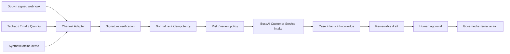

# BossAI Douyin / Taobao Customer Service Connector

[](https://github.com/liufeng1976/douyin-taobao-cs/stargazers)

An **API-free, source-available AI ecommerce customer-service connector reference** for **Douyin Shop, Taobao, Tmall and Qianniu**: signed webhooks, message normalization, stable idempotency, data minimization, human review and governed BossAI Customer Service intake.

**Useful for:** AI customer service, China ecommerce integrations, Douyin/Taobao webhook adapters, human-in-the-loop support workflows, and developers evaluating BossAI without marketplace production credentials.

> You do not need a real Douyin or Taobao merchant API account to clone, run, test or understand this repository.

[中文 README](README.md) · [v1.1.0 Release](https://github.com/liufeng1976/douyin-taobao-cs/releases/tag/v1.1.0) · [60-second feedback / integration question](https://github.com/liufeng1976/douyin-taobao-cs/issues/new?template=community_demo_feedback.yml) · [BossAI website](https://bossaios.com)

**Want to continue from customer service into product research, ecommerce operations, content, sales and approval-aware execution? → [BossAI Ecommerce Agent](https://github.com/liufeng1976/bossai-ecommerce-ai-team-skill)**

If this reference helps you, **Star the repo** so other Douyin/Taobao developers can find it, and open a synthetic-data Issue if you want another message field or platform pattern covered.

## Quick start

Node.js 20+:

```bash
git clone https://github.com/liufeng1976/douyin-taobao-cs.git
cd douyin-taobao-cs
npm ci
npm run demo
```

The demo uses only synthetic messages and demo secrets. It does not call real marketplace APIs, contact customers, mutate orders, refund money, or make external network requests.

After the demo—or if you have an integration question—use the [60-second Community Demo Feedback](https://github.com/liufeng1976/douyin-taobao-cs/issues/new?template=community_demo_feedback.yml). Do not include marketplace credentials or customer data.

Full local verification:

```bash
npm run check
```

The published `v1.1.0` release is validated locally and in GitHub Actions:

```text
20/20 channel-adapter tests passed
17/17 local E2E passed
Channel adapter verification passed
```

## Architecture



This repository does **not** own a second Agent Runtime, approval engine, customer-service state authority, provider router or commerce ledger.

## Safety boundary

All customer-facing output is review-only. Automatic customer message sending, refunds, cancellations, replacements, compensation, order mutations and account mutations remain disabled.

High-risk cases include refunds/returns, complaints/disputes, order changes, payments/accounts, legal/safety issues and privacy/PII.

AI drafting, when configured, goes only through BossAI OS using public `bossai-*` aliases. No direct `DEEPSEEK_API_KEY`, `OPENAI_API_KEY` or similar provider-key path is part of the hardened implementation.

## Real marketplace APIs are optional future integration

Missing Douyin/Taobao credentials do **not** block GitHub publication, offline demo, CI, forks, issues or local development. They only block claims of live marketplace integration or production deployment.

After `npm run demo`, use the [Community Demo Feedback](https://github.com/liufeng1976/douyin-taobao-cs/issues/new?template=community_demo_feedback.yml) form to report compatibility findings, ask about a governed real-platform integration, or discuss a BossAI commercial deployment. Do not post real App Secrets, tokens, cookies or customer PII.

`.env.example` therefore keeps real marketplace channels disabled by default.

## BossAI ecosystem

- [BossAI Ecommerce Agent](https://github.com/liufeng1976/bossai-ecommerce-ai-team-skill) — continue from customer service into ecommerce operations, product research, content, sales and projects.
- [BossAI Radar](https://github.com/liufeng1976/bossai-radar-lite) — discover public pain points, leads and market opportunities.
- [BossAI Video Agent](https://github.com/liufeng1976/bossaios-com-video-agent) — local Windows AI video production.
- [BossAI OS Open](https://github.com/liufeng1976/bossai-os-core) — reusable BossAI skills, workflows and local-AI foundations.
- BossAI commercial entry: <https://bossaios.com>
