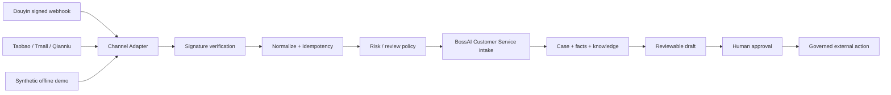

# BossAI Douyin / Taobao Customer Service Connector

An **API-free, source-available reference implementation** for Douyin Shop, Taobao, Tmall and Qianniu customer-service webhook normalization, stable idempotency, data minimization, human review and governed BossAI Customer Service intake.

> You do not need a real Douyin or Taobao merchant API account to clone, run, test or understand this repository.

[中文 README](README.md) · [v1.1.0 Release](https://github.com/liufeng1976/douyin-taobao-cs/releases/tag/v1.1.0) · [60-second feedback / integration question](https://github.com/liufeng1976/douyin-taobao-cs/issues/new?template=community_demo_feedback.yml) · [BossAI website](https://bossaios.com)

## Quick start

Node.js 20+:

```bash
git clone https://github.com/liufeng1976/douyin-taobao-cs.git
cd douyin-taobao-cs
npm ci
npm run demo
```

The demo uses only synthetic messages and demo secrets. It does not call real marketplace APIs, contact customers, mutate orders, refund money, or make external network requests.

If it passed, failed, or you simply want to ask how a real marketplace integration would work later, use the [60-second Community Demo feedback form](https://github.com/liufeng1976/douyin-taobao-cs/issues/new?template=community_demo_feedback.yml). No platform credential is required; never paste customer data.

Full local verification:

```bash
npm run check
```

The published `v1.1.0` release is validated locally and in GitHub Actions:

```text
20/20 channel-adapter tests passed
17/17 local E2E passed
Channel adapter verification passed
```

## Architecture



This repository does **not** own a second Agent Runtime, approval engine, customer-service state authority, provider router or commerce ledger.

## Safety boundary

All customer-facing output is review-only. Automatic customer message sending, refunds, cancellations, replacements, compensation, order mutations and account mutations remain disabled.

High-risk cases include refunds/returns, complaints/disputes, order changes, payments/accounts, legal/safety issues and privacy/PII.

AI drafting, when configured, goes only through BossAI OS using public `bossai-*` aliases. No direct `DEEPSEEK_API_KEY`, `OPENAI_API_KEY` or similar provider-key path is part of the hardened implementation.

## Real marketplace APIs are optional future integration

Missing Douyin/Taobao credentials do **not** block GitHub publication, offline demo, CI, forks, issues or local development. They only block claims of live marketplace integration or production deployment.

After `npm run demo`, use the [Community Demo Feedback](https://github.com/liufeng1976/douyin-taobao-cs/issues/new?template=community_demo_feedback.yml) form to report compatibility findings, ask about a governed real-platform integration, or discuss a BossAI commercial deployment. Do not post real App Secrets, tokens, cookies or customer PII.

`.env.example` therefore keeps real marketplace channels disabled by default.

## BossAI ecosystem

- [BossAI Ecommerce Manager Skill](https://github.com/liufeng1976/bossai-ecommerce-ai-team-skill)
- [BossAI Radar Lite](https://github.com/liufeng1976/bossai-radar-lite)
- [BossAI Video Agent](https://github.com/liufeng1976/bossaios-com-video-agent)
- [BossAI OS Core](https://github.com/liufeng1976/bossai-os-core)
- BossAI commercial entry: <https://bossaios.com>

## Commands

```bash
npm run demo
npm test
npm run test:e2e
npm run verify:channel-adapter
npm run verify:public-release
npm run check
```

Optional real-integration diagnostics:

```bash
npm run check:production-readiness
npm run probe:canonical-integration
```

## Version history

`v1.0.0` remains immutable release history. `v1.1.0` is the current published API-free connector hardening release.

## License

This repository remains under the **BossAI Community Source License 1.0** in [`LICENSE`](LICENSE).

It is source-available, not OSI Open Source. Personal, educational, research, evaluation and other non-commercial uses are licensed subject to the license terms. Commercial operation, client delivery, SaaS, white-label/OEM and other commercial use require BossAI authorization.

If this reference helps your work, star the repository and open issues using synthetic data only. Never post real merchant secrets, tokens or customer PII.
